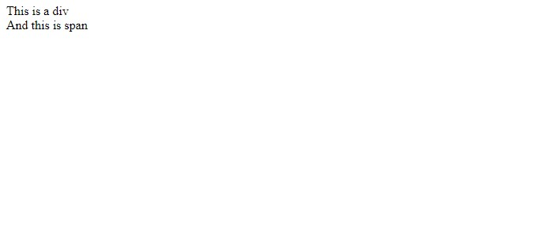

# Divs and Spans

In HTML, <div> and <span> are container elements used to group and style other elements. They do not have any inherent meaning or styling, but they provide structure and allow for targeted styling and manipulation.

The <span> element is used to enclose a specific portion of text, which can be targeted for styling or manipulation. In this case, the span element has no explicit styling, but it can be used as a hook to apply CSS rules or JavaScript functionality to that particular portion of text.

On the other hand, `<div>` element is a container that allows you to group and style other elements together without any specific semantic meaning.

Let's see that in code:

```html
<!DOCTYPE html>
<html>
  <head>
    <title>My First Web Page</title>
  </head>
  <body>
    <div>This is a div</div>
    <span>And this is span</span>
  </body>
</html>
```

Copy the `<div>` and `<span>` lines and paste them into your `index.html`, the one you created in the last lesson. Then right-click anywhere in code and select "Open in Browser"

You will see something like:



### Resource Recommendation

1. <a href="https://youtu.be/yHX-UwAnoqk" target="_blank">Learn HTML span & div in 2 minutes 🏁</a>
