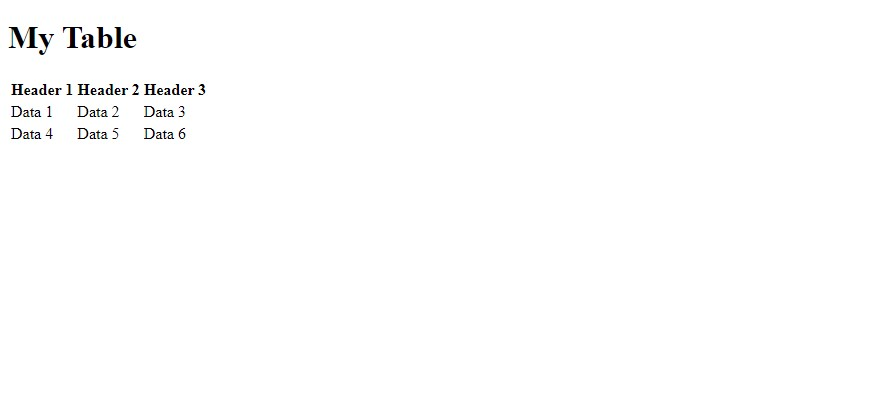

# Tables

HTML tables are used to organize and display tabular data in a structured manner on a web page. Tables consist of rows and columns, forming a grid-like structure.

The `<table>` element is used to define the table, while the `<tr>` element represents each row, and the `<td>` element represents each data cell within the row. Tables can have table headers `<th>` that provide labels for each column or row.

```html
<table>
  <tr>
    <th>Header 1</th>
    <th>Header 2</th>
    <th>Header 3</th>
  </tr>
  <tr>
    <td>Data 1</td>
    <td>Data 2</td>
    <td>Data 3</td>
  </tr>
  <tr>
    <td>Data 4</td>
    <td>Data 5</td>
    <td>Data 6</td>
  </tr>
</table>
```

let's preview the above `table` code.

You will see something like:



### Resource Recommendation

1. <a href="https://www.w3schools.com/html/html_tables.asp" target="_blank">w3schools | HTML Tables</a>
2. <a href="https://youtu.be/dK27jWKtJxs">25: Table In HTML and CSS | How To Create Tables | Learn HTML and CSS | HTML Tutorial | CSS Tutorial</a>
